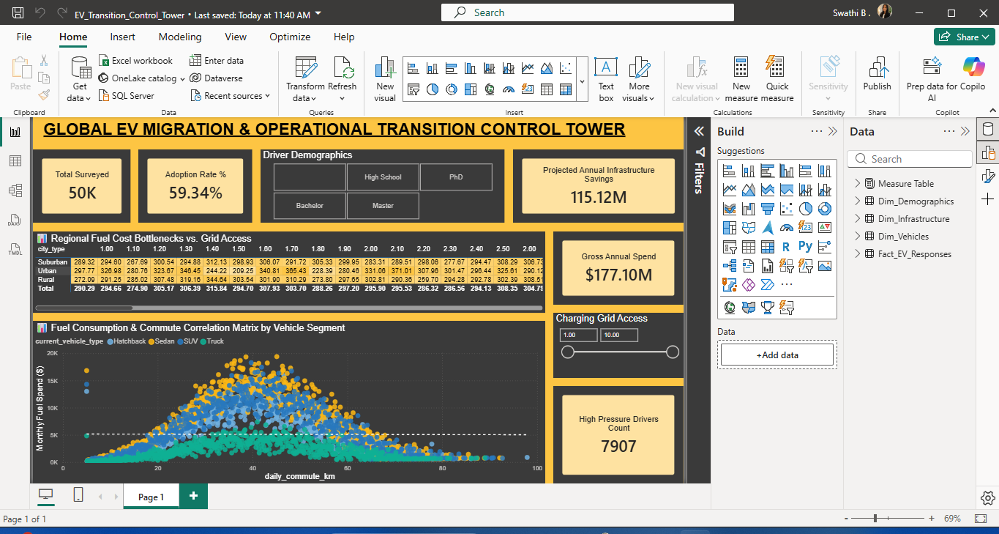

# ⚡ Global EV Migration & Operational Transition Control Tower

## 📊 Executive Dashboard Preview


---

## 🎯 Business Problem Solved
Automotive organizations, logistical fleets, and city planners face fragmented data when predicting where to scale up charging grid investments. This interactive enterprise dashboard transforms **50,000 operational records** into an executive control tower—identifying severe consumer fuel spend pain points and revealing critical regional infrastructure gaps.

---

## 🏗️ Data Architecture & Modeling (Star Schema)
To maximize query performance, column-store compression, and report refresh speeds, the flat source dataset was engineered into an optimized Star Schema:
- **`Fact_EV_Responses`**: The central transactional engine holding numeric values (income, commute distances, monthly fuel expenses).
- **`Dim_Demographics`**: Normalizes driver educational cohorts and age distributions.
- **`Dim_Infrastructure`**: Isolates geographic zones (`city_type`) and charging density indexes.
- **`Dim_Vehicles`**: Details fleet categories (`current_vehicle_type`) and legacy vehicle aging lifecycles.

---

## 🧠 Advanced DAX Calculations Engine
The report relies entirely on performance-optimized, filter-context DAX measures rather than implicit fields:

```dax
// 1. High-Value Conversion Speed Metric
Adoption Rate % = 
DIVIDE(
    CALCULATE([Total Surveyed], 'Fact_EV_Responses'[ev_adoption_likelihood] = "High"),
    [Total Surveyed],
    0
)

// 2. High Operational Pressure Index
High Pressure Drivers Count = 
CALCULATE(
    [Total Surveyed],
    'Fact_EV_Responses'[daily_commute_km] > 50,
    'Fact_EV_Responses'[fuel_expense_per_month] > 200
)

//3. Projected Capital Savings Index or Macro Economic Abatement Index
Projected Annual Infrastructure Savings = 
VAR TotalMonthlyFuel = SUM('Fact_EV_Responses'[fuel_expense_per_month])
RETURN 
(TotalMonthlyFuel * 0.65) * 12

```

---

## 📈 Key Data Insights Uncovered
1. **The Regional Charging Bottleneck**: The *Regional Fuel Cost Bottlenecks vs. Grid Access* data matrix proves that **Rural sectors suffer the heaviest monthly fuel burdens ($270+)** yet experience the lowest level of charging grid accessibility.
2. **The Commuter Migration Catalyst**: Linear scatter plot regression trend lines reveal that commute distances combined with heavy vehicle classes (SUVs/Trucks) act as a far more volatile financial pressure trigger for EV migration than baseline household income brackets alone.

---

## 🛠️ Technology Stack Used
- **Power BI Desktop** (Data Architecture, UI/UX Wireframing, DAX Scripting)
- **Power Query Editor / M-Code** (Multi-column duplicate removal, text formatting)
- **Premium Command Center Styling Architecture** (High-contrast dark slate & gold canvas layout)
